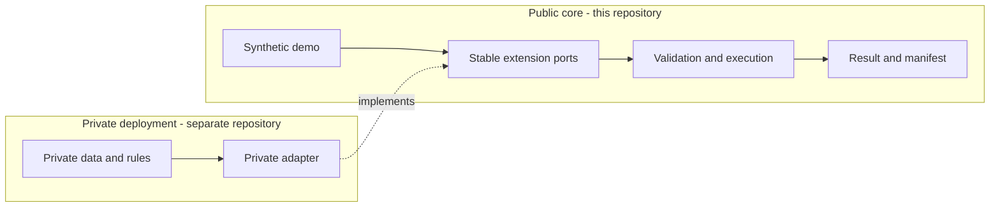

# E2E Platform Forge

An executable, clean-room reference for building auditable end-to-end workflows without coupling the public core to a customer's systems, data, or business rules.

E2E Platform Forge turns a registered capability and a JSON input into deterministic output artifacts. It is intentionally lean: the repository demonstrates the platform contracts, validation boundary, execution path, and provenance manifest with synthetic examples only.

## What it demonstrates

- Discoverable domains and capabilities through a small command-line interface.
- Layered validation around capability execution.
- A predictable workspace layout for every run.
- Deterministic JSON results and SHA-256 artifact digests.
- Stable extension points for separately maintained private adapters.
- Synthetic examples across automation, delivery, governance, and intelligence.

## Quickstart

Prerequisite: Python 3.12 or newer.

```bash
python -m venv .venv
# Windows: .venv\Scripts\activate
# macOS/Linux: source .venv/bin/activate
python -m pip install -e .

e2e-platform-forge list
```

Copy `.env.example` to `.env`, then set `FORGE_ROOT` to an absolute local data
folder. This needs no administrator access.

```bash
e2e-platform-forge sample --domain automation --output .forge/demo-input.json
e2e-platform-forge run --domain automation --capability example --run-id EXAMPLE_RUN --input .forge/demo-input.json
```

The run writes:

```text
<FORGE_ROOT>/DEMO/automation/example/runs/EXAMPLE_RUN/
|-- result.json
`-- manifest.json
```

`result.json` is the capability result. `manifest.json` records the target, validation layers, and SHA-256 digests needed to verify the artifacts. Repeating the same run with the same input produces the same formatted JSON.
Reusing a run identifier with different content is rejected instead of overwriting
the earlier evidence.

Only the physical root and optional default workspace belong in `.env`. Domain,
capability, run, validation, and artifact structure remain typed public contracts.
CLI values override process-environment values, which override `.env` values.
Domains and capabilities use lowercase identities; workspaces and run identifiers
use uppercase identities. That convention prevents aliases on case-insensitive
filesystems.

## Architecture



The public repository owns generic execution mechanics and synthetic demonstrations. A private adapter owns organization-specific integration details and depends on a released version of the public core.

| Public core | Private adapter |
| --- | --- |
| Execution engine and contracts | Live-system connections |
| Generic validation | Customer schemas and mappings |
| Synthetic fixtures | Credentials and private configuration |
| Neutral result and manifest formats | Business rules and branded outputs |
| Public compatibility tests | Private operational tests and runbooks |

This boundary makes two maintenance paths inexpensive:

1. Upgrade a private deployment by changing its pinned core version and running contract tests.
2. Promote a genuinely generic improvement by re-specifying it with synthetic fixtures in the public core, releasing it, and then updating the private adapter.

See [Architecture](docs/architecture.md), [Private adapters](docs/private-adapters.md),
[Upgrade strategy](docs/upgrades.md), [Clean-room policy](docs/clean-room.md), and
[Provenance](docs/provenance.md).

## Rights and commercial use

Copyright (c) 2026 LE THANH TUAN. All Rights Reserved.

This is a source-visible portfolio repository, not an open-source project. The included terms permit portfolio review and non-commercial evaluation only. Production, organizational, consulting, hosted, or other commercial use requires a separate written commercial license. See [LICENSE](LICENSE) and [Commercial licensing](COMMERCIAL.md).

The repository documentation describes the intended ownership and licensing model; it is not legal advice. Each party should obtain independent advice for its circumstances.

## Feedback and security

External pull requests are not accepted. General feedback and reproducible reports using synthetic data are welcome through GitHub Issues; see [CONTRIBUTING.md](CONTRIBUTING.md).

Do not report vulnerabilities in a public issue. Use GitHub private vulnerability reporting as described in [SECURITY.md](SECURITY.md).
